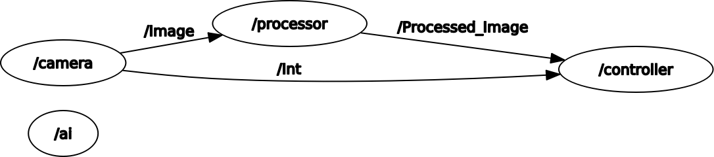
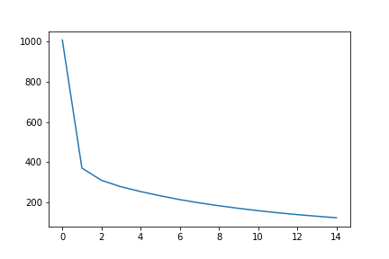
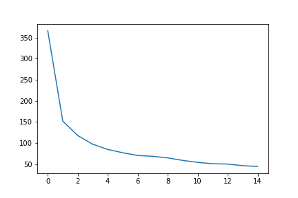
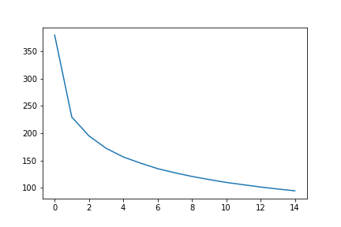
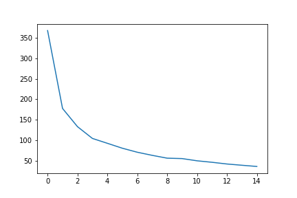
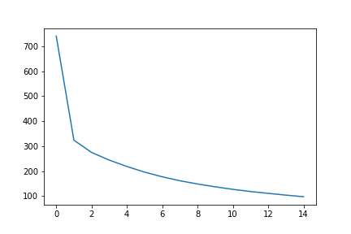
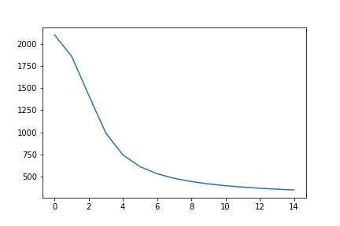
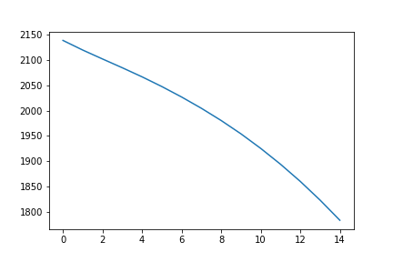

# KI in der Robotik

# Nader Alhalabi - s0561121

# Task 1

Im ersten Task man musste 2 Scripts(Nodes) in Python schreiben (Camera und Processor)
Camera: liest ein zufällige Bild aus dem akutellen Path, dann wandelt es in einem Image-Message(imgmsg) mithilfe von CvBridge:
```
cv2_to_imgmsg(img)
```

Der Camera Node publiziert 2 verschiedene Nachrichten:
1. Dieses Bild an dem Topic "Image"
2. Ein Integer, der das oben gennante Bild entspricht an dem Topic "Int"

Processor: subscribed zu dem Topic "Image" und berarbeitet das Bild mithilfe von cv2-Bibliothek, indem es in einem graustufigen Bild umwandelt und in der Größe anpassen:
```
cv2.cvtColor(img, cv2.COLOR_BGR2GRAY)
cv2.resize(gray,(28,28))
```
und dann wieder in Topic "Processed_Image" publizieren.


# Task 2

Bei dem 2. Task ist ein zusätzliche Node für Controller erstellt, es subscribed zu 2 Topics:
1. Topic "Processed_Image" bei dem der Processor das Graustufige Bild publiziert.
2. Topic "Int" bei dem der Camera Messages von Typ "IntwithHeader" publiziert.

Diesen 2 Nachrichten werden anhand von "message_filter" synchronisiert:
```
info_sub = message_filters.Subscriber('Int',IntwithHeader)
pi_sub = message_filters.Subscriber('Processed_Image',Image)
ts = message_filters.TimeSynchronizer([info_sub,pi_sub],10)
ts.registerCallback(callback)
```
In callback werden das Bild und das entsprechende Integer in einer Liste von Tupeln gespeichert.
Ebenso wird ein Service Proxy für den ai_image_processing erstellt, um mit dem Service ai_image_processing von ai-Node zu kommunizieren.

Der Service 'AIService' sendet ein Image an den ai-node und dieser sendet ein Integer zurück.



# Task 3

### Train and Save Model

Dieses Modell besteht aus einem Inputlayer von 784 Neuronen (entspricht die Dimension der Bilder). 
Dann 2 hidden layer: der erste mit 127, der zweite mit 64 Neuronen, der output layer hat 10 Neuronen (entspricht die Nummern von 0 bis 9). Zwischen den Neuronen steht eine einfache linearen Regression:

$$
I_{(l+1),s}=O_{l}*W_{l,s}
$$
Die Aktivierungsfunktion von dem Hiddenlayer ist ReLU:
$$
f(x) = max(0,x) 
$$

ReLU mappt geradlinig die positive Werte, und gibt 0 für negative Werte zurück.

Die Aktivierungsfunktion von dem Outputlayer ist die LogSoftmax-Funktion


$$
log(\frac{\exp(O_{ol,s})}{\sum_{k=1}^{10}\exp(O_{ol,k})})
$$


Es wurde die negative LogLikelyhood genommen (CrossEntropie loss). 

Trainloader wird für das Training verwendet, das in batches von 64 loadet und schuffle wird auch benutzt damit wir ein solidere Model bekommen. Es wurde 15 mal über diese Daten iteriert und die loss von jeweils berechnet werden.

Das Training der Netze verwendet backpropagation, dieses Algorithmus nutzt das so genannte "Chain Rule" von Ableitungen, um Gradienten für die Gewichte lokal zu berechnen. Diesen Gradienten zeigen wo die nächste tiefere Ebene ist, und können wir dann die Gewichte bzw. Parametern aktualisieren, und durch ein iteratives Prozess erreicht dieses Gradient an dem tiefesten Punkt von der Funktion. Adam wurde für diese Aufgabe verwendet.

In dem angehängten Jupyter-Notebook ist die konkrete Implementierung erläutert, wo nötig ist.

### Load Model and Predict

Das trainierte Model wurde dann gespeichert und von ai.py geladen mit: 
```
model=torch.load(current_folder+"/my_mnist_model.pt")
```

Der Camera Node generiert eine zufällige  Zahl zwischen 0 und 9, lädt das entsprechende Bild und gibt es wie vorher beschrieben weiter. 
Dann Processor ändert die Auflösung zu "28x28" und auch den Colour-space zu Grauwerten wie folgenden:

```
img = cv_bridge.imgmsg_to_cv2(img_msg)
pro_img=cv2.cvtColor(img,cv2.COLOR_BGR2GRAY)
pro_img=cv2.resize(pro_img,(28,28))
```

In Node 'ai' wird das von Controller empfangene Bild zu einem Tensor gewechselt, und aus dem Model die Ergebnisswert herausgefunden und wieder zu den Controller übermittelt:

```
pic=transform(img)
pred_number=model(pic.view(1,784))
pred_number=np.exp(pred_number.detach().numpy())
```

### Evaluating Different Setups


Vershiedene Varianten dieses neuronalen Netze werden mit vershiedenen Werten trainiert.
Erstens sind verchiedene Optimizern versucht werden, damit wir eine grobe Übersicht über den jeweiligen Training Ablauf bzw. Loss.

Folgend werden die Algorithmen mit der jeweiligen default Learning rates trainiert

Adam|SGD
---|---
 |  

Adadelta|Adagrad
---|---
 |  

Wir bemerken dass alle Algorithmen mit default-LR mehr oder weniger die gleiche Performanz haben, deshalb vertiefen wir mit Learning rates, und zwar mit der beliebte Algorithmen nämlich SGD und Adam

1. Adam

0.01|0.001|0.0001
---|---|---
 |  |  

Aus der Graphen finden wir dass Adam sehr kleine Beeinflussung von der Learning rate hat.


2. SGD

0.01|0.001|0.0001
---|---|---
 |  |  

An der anderen Seite hier SGD ist von der Learning rate sehr beeinflußt, großere LR führen zu bessere Ergebnisse.

Außerdem Accuracy war sehr gut mit allen Algorithmen:

- SGD = 0.9573
- Adam = 0.9704
- Adagrad = 0.9654
- Adadelta = 0.9756

Adadelta hat die beste Accuracy  mit sehr kleinen Abstand, aber Adam war schneller in dem Learning Prozess, deswegen wurde es für das Model gewählt.

## Verwendung

- build catkin: 

   ```
   $ cd /catkin_ws
   $ catkin_make
   $ ./catkin_ws/devel/setup.bash
  ```
- Das Model in Jupyter Notebook trainieren
- Das Model-Datei in "scripts" Verzeichnis kopieren

```
cp my_mnist_model.pt /catkin_ws/src/beginner_tutorials/scripts
```
- roslaunch launch/launchtask1 ausführen im Verzeichnis beginner_tutorial.


